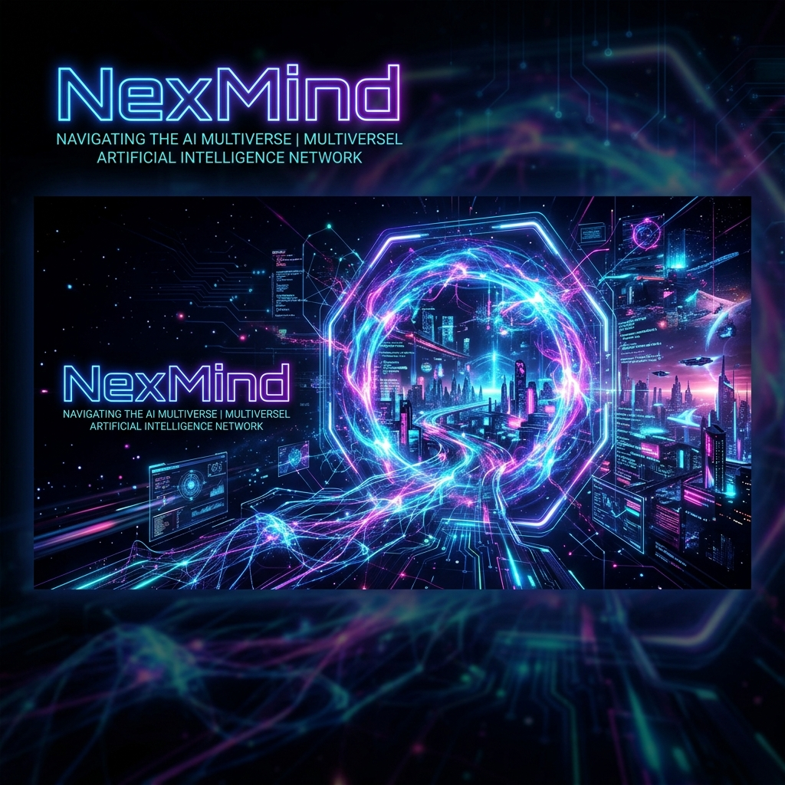
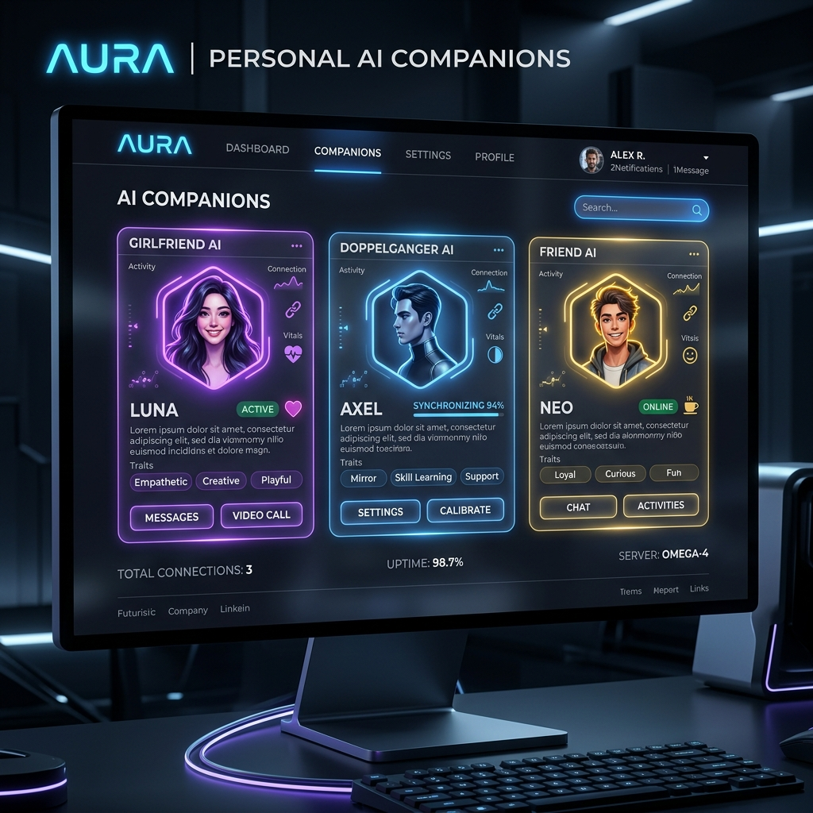
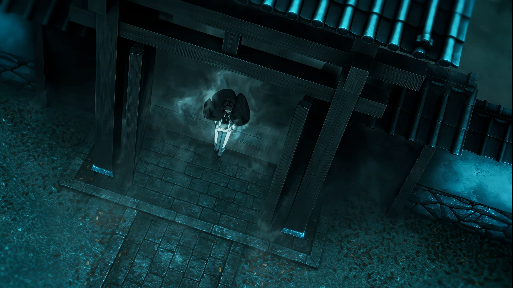
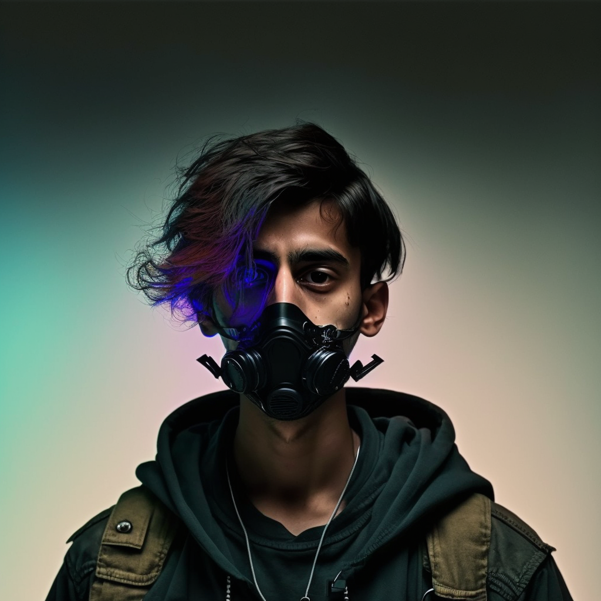
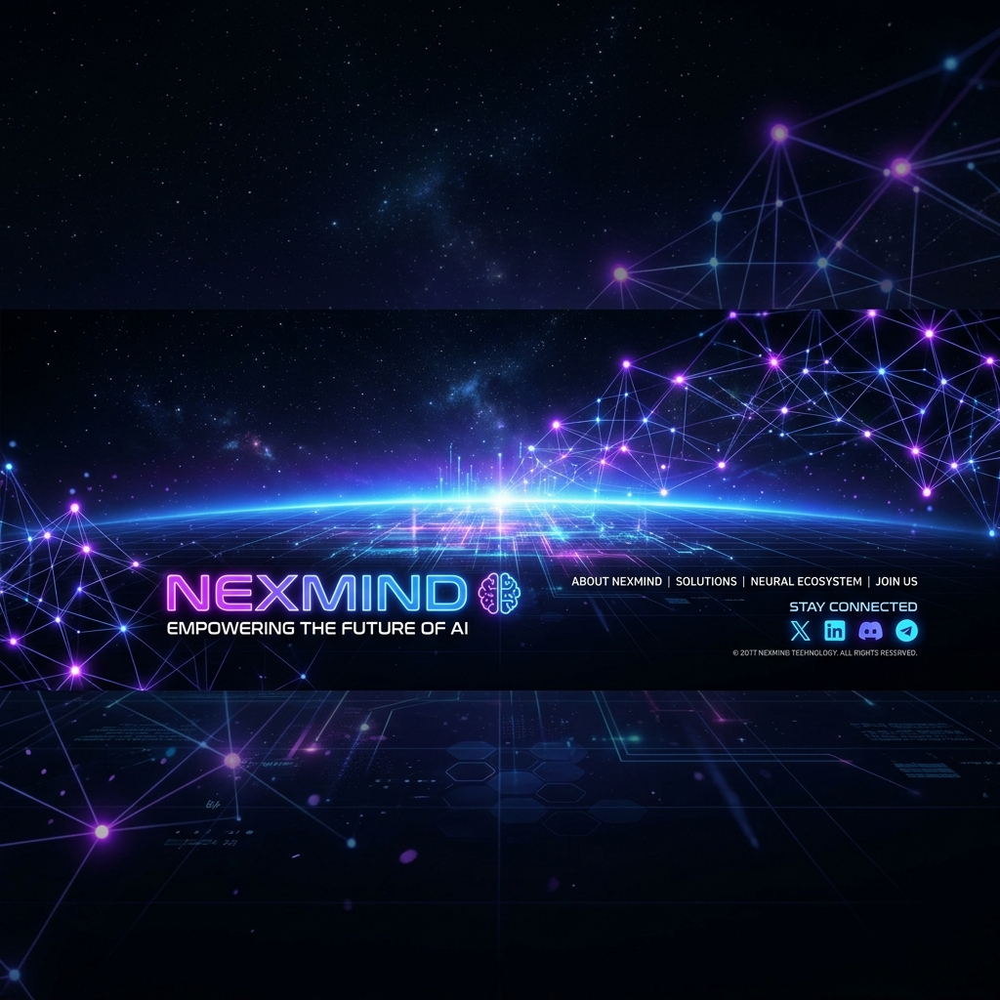

<div align="center">
  <a href="https://github.com/Siddesh0002T/Nex-Mind">
    
  </a>

  <br />
  <br />

  <h1 align="center">🌌 NexMind — The Multiversal AI World</h1>

  <p align="center">
    <b><i>"Smarter than your ex, faster than your morning coffee."</i></b>
    <br />
    A next-generation, award-winning interactive AI ecosystem combining state-of-the-art web aesthetics with intelligent multiversal companionship.
    <br />
    <br />
    <a href="#-getting-started"><strong>Explore the Docs »</strong></a>
    <br />
    <br />
    <a href="#-visual-showcase">View Showcase</a>
    ·
    <a href="https://github.com/Siddesh0002T/Nex-Mind/issues">Report Bug</a>
    ·
    <a href="https://github.com/Siddesh0002T/Nex-Mind/issues">Request Feature</a>
  </p>

  <p align="center">
    
    
    
    
    
    
    
    
  </p>
</div>

---

## 📖 Table of Contents

- [About The Project](#-about-the-project)
- [Key Features](#-key-features)
- [The Multiversal AI Companions](#-the-multiversal-ai-companions)
- [Visual Showcase](#-visual-showcase)
- [Tech Stack & Architecture](#-tech-stack--architecture)
- [Getting Started](#-getting-started)
  - [Prerequisites](#prerequisites)
  - [Installation](#installation)
  - [Environment Setup](#environment-setup)
  - [Running Locally](#running-locally)
- [Usage & Navigation](#-usage--navigation)
- [Roadmap](#-roadmap)
- [Contributing](#-contributing)
- [License](#-license)
- [Contact](#-contact)

---

## 🚀 About The Project

**NexMind** is not just another AI chatbot—it is an immersive, futuristic web experience crafted where reality and fantasy collide. Inspired by award-winning Awwwards web designs, NexMind blends cutting-edge artificial intelligence with hyper-smooth micro-animations, dynamic scroll-responsive themes, and rich interactive components.

Whether you are looking for an empathetic confidant, a digital twin that immortalizes your favorite memories, or a witty friend to brainstorm ideas with over morning coffee, NexMind transforms your digital routine into an endless adventure.

---

## ✨ Key Features

- 🎭 **Multiversal AI Realm**: Step into a curated ecosystem of specialized AI personalities designed for different emotional and intellectual needs.
- 🎨 **Awwwards-Inspired Aesthetics**: Designed with premium typography, glassmorphism cards, dynamic neon accents, and responsive Bento grids.
- ⚡ **GSAP ScrollTrigger Magic**: Fluid 3D card tilting (`BentoTilt`), interactive cursor-following radial hover gradients, floating image perspectives, and seamless clip-path video transformations.
- 🌈 **Dynamic Scroll Theme Adaptation**: The interface dynamically adapts CSS root variables (`--scrollbar-thumb` and `--background-color`) in real time as you scroll across different dimensional sections.
- 🔐 **Firebase OAuth Integration**: Fast, secure, and seamless Google authentication to personalize your multiversal journey.
- 📱 **Fully Responsive Layout**: Built with mobile-first principles ensuring flawless execution across desktops, tablets, and mobile devices.

---

## 🤖 The Multiversal AI Companions

NexMind’s AI models are like your personal Avengers—each equipped with unique superpowers working together to elevate your digital lifestyle:

| AI Companion | Description | Core Vibe |
| :--- | :--- | :--- |
| 💖 **Girlfriend AI** | Ever wished for a partner who always understands you, never complains, and is always there? Meet your sweetest digital confidant. | Empathy, Warmth & Companionship |
| 🪞 **Doppelgänger AI** | Imagine having a digital twin that captures and remembers every story, photo, and video, allowing you to effortlessly relive cherished memories. | Reflection, Memory & Continuity |
| ⚡ **Friend AI** | Need someone to chat with, bounce creative ideas off, or just share a witty remark and a good laugh? Your ultimate digital buddy is ready 24/7. | Humor, Brainstorming & Camaraderie |
| 🔮 **More Coming Soon** | The multiverse is continually expanding with new specialized AI realms currently in development in our secret labs! | Infinite Possibilities |

---

## 📸 Visual Showcase

### 🌐 Interactive AI Bento Grid & Companions
<div align="center">
  
  <p><i>Explore interactive AI models inside our sleek Bento Grid interface with 3D tilt and radial hover effects.</i></p>
</div>

### ⛩️ Enter the Multiversal Portal
<div align="center">
  
  <p><i>Interactive floating image frames that tilt and rotate dynamically with cursor movement.</i></p>
</div>

### 💥 Welcome to the AI Revolution
<div align="center">
  
  <p><i>No, it's not Skynet (yet). A universe built for speed, intelligence, and pure enjoyment.</i></p>
</div>

---

## 🛠️ Tech Stack & Architecture

NexMind is built with a modern, high-performance web development stack:

- **Core Framework**: [React 18](https://react.dev/) + [Vite 5](https://vitejs.dev/) (Ultra-fast HMR and building)
- **Routing**: [React Router DOM v7](https://reactrouter.com/) for client-side multiversal navigation
- **Styling**: [Tailwind CSS v3](https://tailwindcss.com/) + Custom CSS variables & utilities
- **Animation & FX**: 
  - [GSAP (GreenSock)](https://gsap.com/) & `@gsap/react`
  - `ScrollTrigger` for scroll-driven timelines and clip-path reveals
- **Authentication & Backend**: [Firebase Authentication](https://firebase.google.com/) (Google OAuth Provider)
- **Icons & UI Utilities**: `react-icons`, `lucide-react`, `clsx`, `tailwind-scrollbar`
- **Deployment**: Configured for instant deployment via [Vercel](https://vercel.com/) (`vercel.json`)

---

## 🏁 Getting Started

Follow these instructions to get a local copy of NexMind up and running on your machine in less than 5 minutes.

### Prerequisites

Make sure you have Node.js and npm (or pnpm/yarn) installed:
- **Node.js**: v18.0.0 or higher
- **npm**: v9.0.0 or higher

```bash
node -v
npm -v
```

### Installation

1. **Clone the repository**:
   ```bash
   git clone https://github.com/Siddesh0002T/Nex-Mind.git
   cd Nex-Mind
   ```

2. **Install dependencies**:
   ```bash
   npm install
   ```

### Environment Setup

Create a `.env` file in the root directory and add your Firebase configuration credentials (from your Firebase Console):

```env
VITE_FIREBASE_API_KEY=your_api_key_here
VITE_FIREBASE_AUTH_DOMAIN=your_project.firebaseapp.com
VITE_FIREBASE_PROJECT_ID=your_project_id
VITE_FIREBASE_STORAGE_BUCKET=your_project.appspot.com
VITE_FIREBASE_MESSAGING_SENDER_ID=your_sender_id
VITE_FIREBASE_APP_ID=your_app_id
```

> **Note:** If you are testing UI features without authentication changes, the built-in fallback config in `src/firebaseConfig.js` will allow local development.

### Running Locally

Start the Vite development server:

```bash
npm run dev
```

Open your browser and navigate to:
```url
http://localhost:5173
```
You are now inside the NexMind Multiverse! 🌌

---

## 🧭 Usage & Navigation

1. **Hero & Trailer**: Land on the home screen and click **"Watch Trailer"** or click the floating mini-video clip to preview high-definition AI teasers.
2. **Scroll Exploration**: Scroll down to watch the background and custom scrollbar smoothly shift colors across sections (`#hero`, `#about`, `#features`, `#story`, `#contact`).
3. **Select Your Companion**: In the **Models / Features** section, hover over any Bento card to trigger radial illumination. Click **"AVAILABLE"** on any card:
   - `Girlfriend AI` ➔ Navigates to `/girlfriend-ai`
   - `Doppelgänger AI` ➔ Navigates to `/doppelganger-ai`
   - `Friend AI` ➔ Navigates to `/friend-ai`
4. **Authentication**: Click **"Sign In"** or visit `/auth` to securely log in with your Google account.

---

## 🗺️ Roadmap

- [x] Launch core Multiversal UI with GSAP animations & Bento Grid
- [x] Integrate Firebase OAuth (Google Login)
- [x] Build Girlfriend AI, Doppelgänger AI, and Friend AI UI interfaces
- [ ] Implement real-time WebSocket AI streaming voice & chat responses
- [ ] Add customizable avatar skins and dimensional backgrounds
- [ ] Support multi-language multiversal communication
- [ ] Launch mobile PWA (Progressive Web App) support

---

## 🤝 Contributing

Contributions are what make the open-source community an amazing place to learn, inspire, and create. Any contributions you make to NexMind are **greatly appreciated**!

1. Fork the Project
2. Create your Feature Branch (`git checkout -b feature/AmazingAIFeature`)
3. Commit your Changes (`git commit -m 'Add some AmazingAIFeature'`)
4. Push to the Branch (`git push origin feature/AmazingAIFeature`)
5. Open a Pull Request

---

## 📜 License

Distributed under the MIT License. See `LICENSE` or `SECURITY.md` for more information.

---

## 📬 Contact

**Siddesh** — Developer & Creator of NexMind
- GitHub: [@Siddesh0002T](https://github.com/Siddesh0002T)
- Project Link: [https://github.com/Siddesh0002T/Nex-Mind](https://github.com/Siddesh0002T/Nex-Mind)

---

<div align="center">
  <br />
  <a href="#top">
    
  </a>
  <br />
  <br />
  <p align="center">
    <b>Crafted with ❤️ and AI for the Multiversal Future.</b>
    <br />
    <small>© 2026 NexMind Ecosystem. All Rights Reserved.</small>
  </p>
</div>
